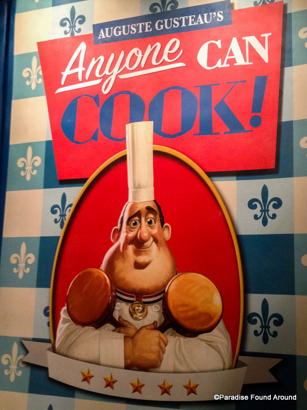

# MasterChef

#### Project Goals:
We set to solve three problems: Firstly, we want to predict the quality of a recipe(measured by its rating and make it again score) based on preparation steps as well as few other engineered
features such as the number of ingredients, and recipe picture availability. We will be using NLP along with pySpark to train the models such as Naive Bayes, and Random Forest. Secondly, we would like to recommend tags based on a clustering algorithm such as k-means. Thirdly, we would use deep learning to recommend recipes based on images and similarity measures such as Cosine or Euclidean.

#### Dataset:
We scraped approx 6000 recipes currently on Epicurious.com for
our data set after filtering out recipes with fewer
than 10 reviews. For scraping, we used the Python libraries Splitner and BeautifulSoup. 
For each recipe, we scraped its ingredients, preparation steps, image source, number of reviews, tags, user ratings and make it again scores, and the titles. The dataset was then stored in a NoSQL MongoDB database in Heroku. 

#### Inspiration:
The inspiration for this project was based on Machine Learning
Final Project posters published online at http://cs229.stanford.edu/projects2016.html.

#### Project Team:
* Tom Berton
* Stephen Schadt
* Asela Dassanayake

